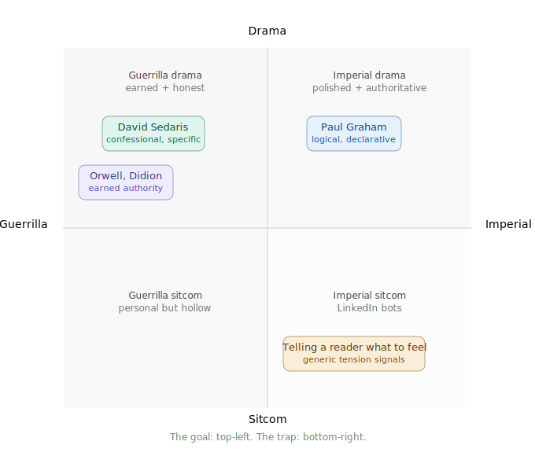

> [!NOTE] Claude's Context
> The user is building a personal writing framework for publishing articles — likely on LinkedIn or a similar platform — where the goal is resonance over reach. They're not optimising for engagement metrics or algorithmic performance; they're writing for a specific audience who will genuinely connect with the ideas.
>
> The framework serves two purposes simultaneously: using writing as a thinking tool (input pass) to gain genuine clarity on what they actually believe, and then shaping that into something that earns engagement through precision and honesty rather than formulaic tension-signalling.
>
> The underlying philosophy is that good writing doesn't tell readers what to feel — it constructs the conditions for them to feel it themselves. That's what separates it from the LinkedIn-bot style of content that mimics the structure of good writing without doing the actual work.

## The two passes

Writing serves two different people at different times — you first, then your reader. Conflating them produces work that is neither clear to you nor engaging to them.

**Input pass (for you)** — write without editing. Chase the question. The goal is not a draft; it's an honest answer to: *what do I actually believe here, and why?* You're done when you've surprised yourself.

**Output pass (for them)** — now you have something real to say. Structure it so the reader arrives at the insight themselves rather than being told it exists.

## Input pass

One question: **have you surprised yourself yet?**

If yes, stop. If no, keep writing. Any other criteria is output-pass thinking arriving too early — it kills the exploration before you find the thing worth saying.

## Output pass

### Structure

Every piece follows the same spine:

1. **Hook** — creates a question in the reader's mind
2. **Tension** — why is the answer non-obvious? What do most people believe, and why is that incomplete? This earns the right to your insight.
3. **Insight** — your actual point. One sentence if the input pass went well.
4. **So what** — what should the reader do, think, or feel differently? This is what makes people share — not the insight itself, but the feeling of being changed by it.

### Show, don't tell

The goal is to put the reader *inside* the moment, not announce that the moment exists.

Telling: *"most people get this wrong"*
Showing: describe the specific situation where the mistake happens — the reader recognises themselves, feels the tension, and arrives at your reframe as if it were their own thought.

Ideas feel more powerful when the reader discovers them. You're constructing the conditions for that discovery.

**The TV drama vs sitcom distinction:** a good drama trusts you to feel the emotion from the scene. A bad sitcom pipes in a laugh track to tell you when something is funny. LinkedIn bots are laugh tracks — they announce tension ("here's what most people miss") rather than creating it. Write drama.

### Proofreading the output pass

Three passes, one lens each:

**Meaning pass** — does every sentence say exactly what you mean? Check for unconscious hedging ("kind of", "in a way") and decide deliberately whether it belongs.

**Earning pass** — label each paragraph as either *building tension* or *delivering insight*. If you can't label it, cut it.

**Skeptic pass** — read it as someone who mildly disagrees with you. Where would they check out? Where is the logic a leap taken on faith? Those spots need more showing.

One technique that cuts across all three: **read it aloud**. Your mouth catches what your eyes skip.

## The relationship between the two passes

They are sequential, not parallel. You cannot write something engaging until you are clear on what you actually think. Skipping the input pass produces work that is organised but not interesting — because the writer never found their real point.

The showing-not-telling discipline in the output pass only works if there's something genuine to show. That's what the input pass is for.

## The writing compass

Two axes determine the character of a piece of writing. **Craft** (vertical) is about what the writing does at the sentence level — does it create tension through showing, or announce it through telling? **Disposition** (horizontal) is about the posture behind the writing — is authority earned through specificity, or assumed from position?

The goal is the top-left quadrant: guerrilla drama. Writing that finds its way in through the side door because it has to, and constructs the conditions for the reader to feel something rather than instructing them to. The trap is bottom-right: imperial sitcom — the LinkedIn-bot mode, where tension is signalled rather than created, from a position of assumed authority.

The two axes are independent. Imperial drama (top-right) is polished, well-crafted writing that still writes from authority — think certain long-form journalism or TED-style essays. Guerrilla sitcom (bottom-left) is personal and honest in disposition but lazy in craft — the anecdote that goes nowhere.


