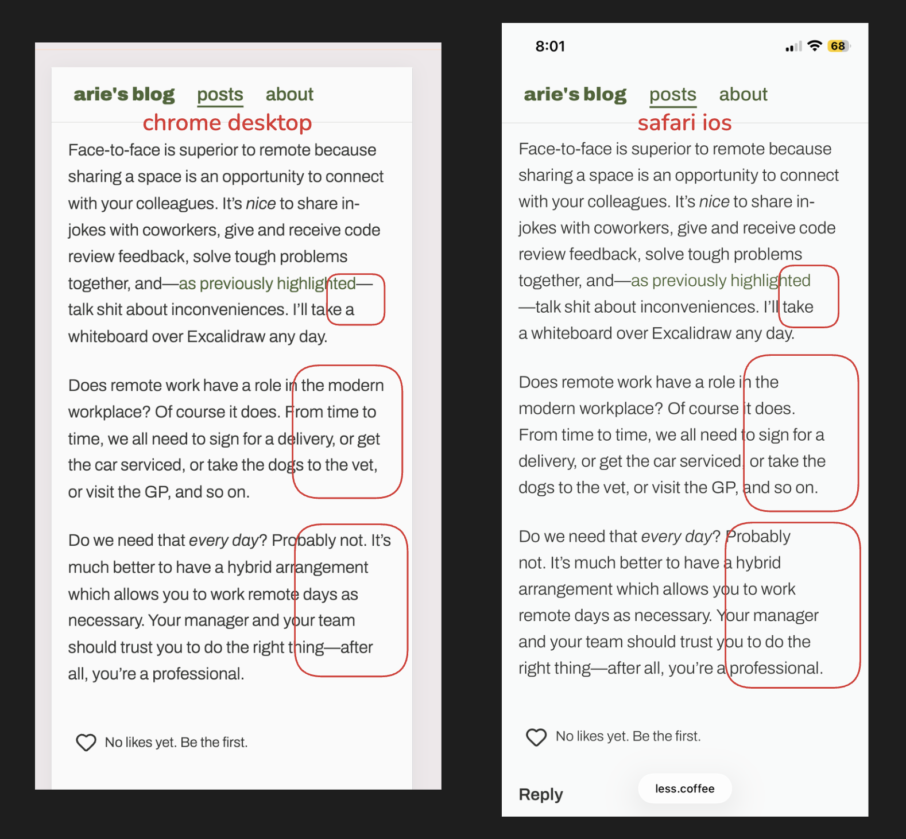
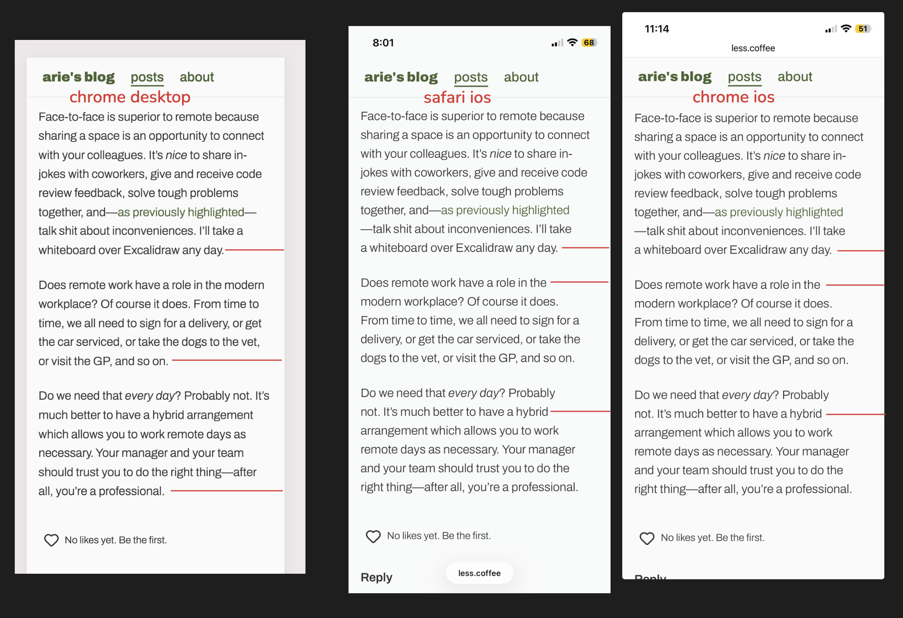
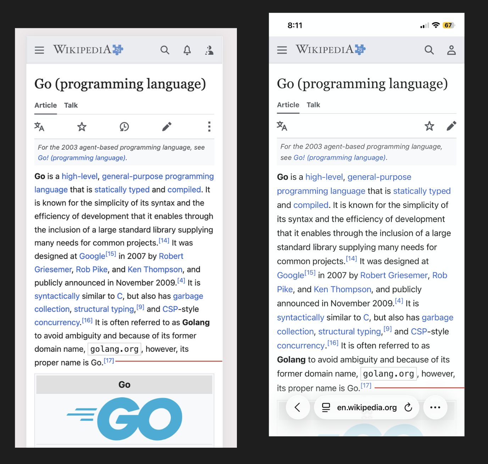

I've spent a fair bit of time tinkering with the CSS on less.coffee. A significant portion of that time was spent fidgeting with text wrapping. In particular, I've been testing out the [(relatively) new "pretty" option for text wrapping](https://developer.mozilla.org/en-US/docs/Web/CSS/Reference/Properties/text-wrap#:~:text=Results%20in%20the%20same%20behavior%20as%20wrap%2C%20except%20that%20the%20user%20agent%20will%20use%20a%20slower%20algorithm%20that%20favors%20better%20layout%20over%20speed.%20This%20is%20intended%20for%20body%20copy%20where%20good%20typography%20is%20favored%20over%20performance%20(for%20example%2C%20when%20the%20number%20of%20orphans%20should%20be%20kept%20to%20a%20minimum).). Overall, it seems to work, but I've noticed some unexpected nuance in rendering across different platforms.

For example, see the screenshot below. On macOS Chrome dev tools "responsive mode" vs iOS Safari, these two pages wrap text at different points in the paragraph:

Believe it or not: both screenshots have `text-wrap: pretty` applied.

Could it be subpixel antialiasing? [macOS disables subpixel AA](https://en.wikipedia.org/wiki/Subpixel_rendering#macOS:~:text=However%2C%20it%20was%20removed%20after%20the%20introduction%20of%20Retina%20displays.), but I thought that iOS must be allowing it, since the font rendering looks a lot thinner and sharper. That _might_ affect the width of each character? I'm not using the `font-smoothing` reset either. But this doesn't really make sense—if Apple disables subpixel AA on macOS because of Retina Display, then surely they would disable it on iOS from the start, since the iPhone pixel density has historically been higher than a desktop monitor.

I can't find a source, but I am pretty sure iOS never had subpixel AA because _you can't guarantee the orientation of the device_, so you effectively need to [implement subpixel logic for two distinct subpixel configurations](https://mjtsai.com/blog/2018/07/13/macos-10-14-mojave-removes-subpixel-anti-aliasing/#:~:text=Subpixel%20antialiasing%20is%20obnoxious%20to%20implement.).

I concluded that Safari (and presumably, other browsers on mobile) must use the OS's text wrapping algorithms, because this looks the same in iOS Chrome. It also seems like iOS has a slightly different text wrapping algorithm. Maybe it's more aggressively trying to balance the rag? An interesting property I noticed was that the length of the shortest line (or <abbr title="Length of Shortest Line">LOSL</abbr>) is greater on iOS compared to macOS:

Finally, I decided to test a website out in the wild, with default user agent `text-wrap`, and this is the difference:

I have a hard time deciding if left or right is better in this screenshot. Left looks pretty dense, but right's rag is a bit more jagged. The LOSL is quite similar between both paragraphs.

I could be scaling the image wrong, but it really seems like iOS renders the font slightly bigger. That would explain why inline iconography sometimes looks out of position on iOS—placing a block element inline with a text span ends up looking out of alignment when the text height adjusts the container height.

There's nothing, really, to conclude here, other than the fact that I find it interesting. Even with the same viewport width, same CSS, same assets, the two different platforms render text subtly differently. Perhaps something to consider when designing websites!
