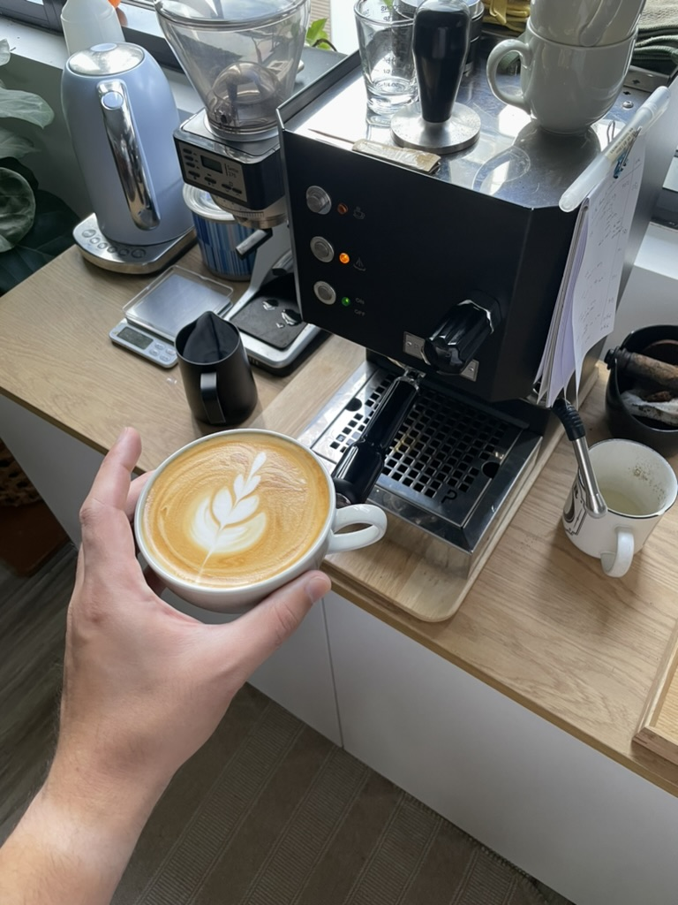

{.portrait}

## Summary

Great little machine, effortlessly simple to use, and ships with some luxuries (OPV and PID control). Reliable and consistent. Aesthetically pleasing if you're going for an industrial or utilitarian feel—it shows you what you need without over-complicating the interface.

The price is a bit higher than other single-boilers, so I was expecting the experience to be more "polished" with much less rattle. For some reason it ships with a two-hole steam wand rather than the more common single-hole steam wand.

## Pros

I love the Go's single-boiler form factor. It's got a big enough tank that I'm getting through about 10 coffees before needing to refill, yet doesn't dominate the countertop where it lives.

You get some high-end features out-of-the-box: OPV and PID control are usually only found in more expensive dual-boilers.

It heats up pretty fast. Not as fast as something like a Barista Express[^bbe], but still pretty fast. Like maybe 10 minutes or less. It's perfectly reasonable for me to switch the machine on first thing in the morning, then change into workout clothes or make some quick breakfast before brewing my coffee. Even with the fast heat up, the temperature is pretty stable through the shot. The built-in thermometer reads only a few degrees lower than the starting temperature.

[^bbe]: Whether that machine is _truly ready_ after the short heat-up time is a point of contention.

I'm fond of the ergonomics as well. The Go's controls are all front-facing which reduces its overall footprint. It seems insignificant, but something as simple as being able to steam milk with your right hand while opening the valve with your left hand makes the experience enjoyable.

## Cons

The first one or two releases of the Go rattle... a lot. While the machine has a satisfyingly utilitarian aesthetic, the housing is literally constructed from folded sheet metal, and the vibration pump causes the tank cover and drip tray to rattle during extraction.

Speaking of drip trays—the short and stout stature of the machine means there's very little headroom under the portafilter. Taller cups need to be threaded underneath the spouts. I solved this by buying shorter cups, but you could also swap out the stock portafilter for a _naked portafilter_—with the added benefit of better shot diagnosis.

## Tips

### Pressure

The pressure gauge on the Go is irrelevant when pulling a shot. This gauge is measured from the boiler, not the group head. It's useful for calibration using a blind basket and the OPV setting—not for predicting the quality of the shot. What actually matters is _taste_, which is a function of _yield_ (dose, volume, and extraction time).

Pressure should be optimal from factory, but if you need to re-calibrate, install the blind basket into the portafilter and start pulling a shot. Then use the handle of a spoon to turn the OPV dial on the top of the machine until the pressure gauge reads **9 bar**. I'm told this is approximately 8 bar at the group head.

### Steam Wand (for Milk-based Coffee)

Hold the steam wand in the centre of the milk's surface. The stock steam wand has two openings, which form two milk vortexes on either side. This is sufficient for achieving a microfoam. Online tutorials will recommend forming a vortex by holding the wand off-centre, but you should ignore this if you've got the two-hole wand.

